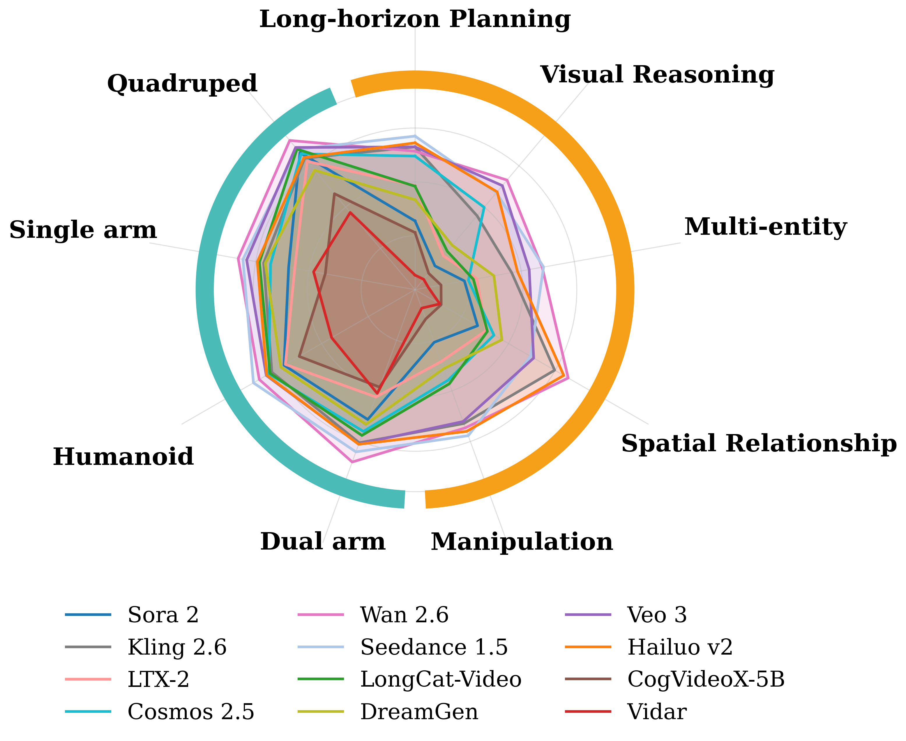
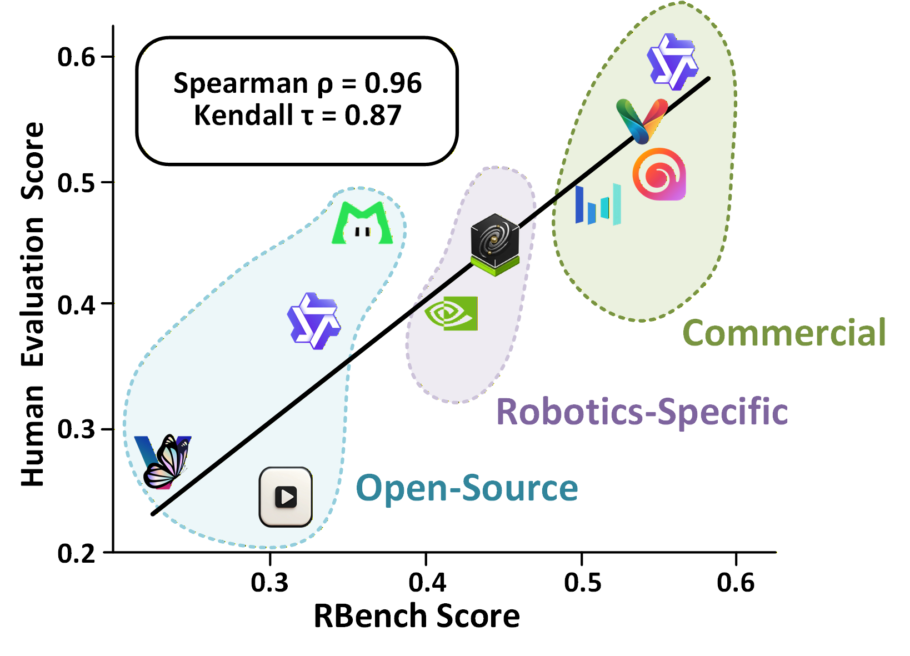
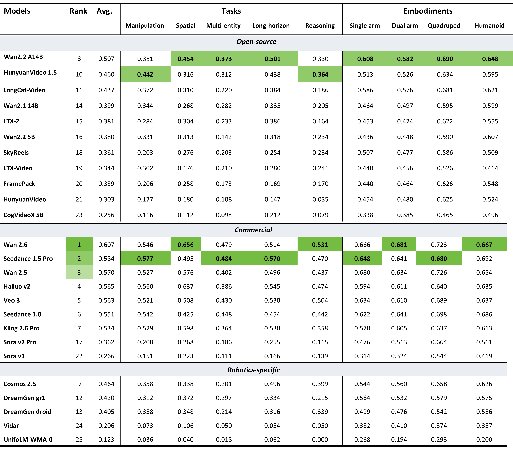

<div align="center">
<div align="center">
  
</div>
  
## Rethinking Video Generation Model for the Embodied World

[](https://huggingface.co/spaces/DAGroup-PKU/RBench-Leaderboard/)
[](https://arxiv.org/abs/2601.15282)
[](https://dagroup-pku.github.io/ReVidgen.github.io/)
[](https://huggingface.co/datasets/DAGroup-PKU/RoVid-X/)
[](https://huggingface.co/datasets/DAGroup-PKU/RBench/)
[](https://youtu.be/Ea91ErBMBLM)
[](YOUR_LINK)

[Yufan Deng](https://dagroup-pku.github.io/ReVidgen.github.io/), 
[Zilin Pan](https://dagroup-pku.github.io/ReVidgen.github.io/), 
[Hongyu Zhang](https://dagroup-pku.github.io/ReVidgen.github.io/), 
[Xiaojie Li](https://dagroup-pku.github.io/ReVidgen.github.io/), 
[Ruoqing Hu](https://dagroup-pku.github.io/ReVidgen.github.io/), <br>
[Yufei Ding](https://yufeiding.com/), 
[Yiming Zou](https://dagroup-pku.github.io/ReVidgen.github.io/), 
[Yan Zeng](https://scholar.google.com/citations?user=-zT0sBsAAAAJ&hl=zh-CN), 
[Daquan Zhou](https://zhoudaquan.github.io/homepage.io/)

</div>

## 📣 Overview

This repository is the official implementation of our work, consisting of (i) RBench, a fine‑grained benchmark tailored for robotics video generation, and (ii) RoVid-X, a million‑scale dataset for training robotics video models. We reveal
the limitations of current video foundation models and potential directions for improvement, offering new perspectives for researchers exploring the embodied domain using video world models. Our goal is to establish a solid foundation for the rigorous assessment and scalable training of video generation models in the field of physical AI, accelerating the progress of embodied AI toward general intelligence.
## 🔥 News
* `[Ongoing]` 🔥 We are actively training a physically plausible robotic video world model and applying it for real-world deployment in downstream robotic tasks. Stay tuned!
* `[2026.1.27]`  🔥 We are actively applying for the open-source process. Once the internal review is approved, we will release the RoVid-X robotic video dataset on [Hugging Face](https://huggingface.co/datasets/DAGroup-PKU/RoVid-X) and open-source the RBench on [Hugging Face](https://huggingface.co/datasets/DAGroup-PKU/RBench).
* `[2026.1.22]`  🔥 Our [Research Paper](https://arxiv.org/abs/2601.15282) is now available.  The [Project Page](https://dagroup-pku.github.io/ReVidgen.github.io/) is created.
## 🎥 Demo
https://github.com/user-attachments/assets/3d00cf52-3631-41c2-9eca-b580404e710f

## 📑 Todo List
- [ ] **Embodied Execution Evaluation**: Measure the action execution success rate of generated videos using Inverse Dynamics Model (IDM).

## ⚙️ Installation
### Environment

```bash
# 0. Clone the repo
git clone https://github.com/DAGroup-PKU/ReVidgen.git
cd ReVidgen

# 1. Environment for RBench
conda create -n rbench python=3.10.18
conda activate rbench

pip install --upgrade setuptools
pip install torch==2.5.1 torchvision==0.20.1

# Install Grounded-Segment-Anything module
cd pkgs/Grounded-Segment-Anything
python -m pip install -e segment_anything
pip install --no-build-isolation -e GroundingDINO
pip install -r requirements.txt

# Install Groudned-SAM-2 module
cd ../Grounded-SAM-2
pip install -e .

# Install Q-Align module
cd ../Q-Align
pip install -e .

cd ..
pip install -r requirements.txt

```
### Download Checkpoints

Please download the checkpoint files from **[RBench](https://huggingface.co/datasets/DAGroup-PKU/RBench)** and organize them under the following directory before running the evaluation:
```shell
ReVidgen/
├── checkpoints/
│   ├── BERT
│   │   └── google-bert
│   │       └── bert-base-uncased
│   │           ├── LICENSE
│   │           └── ...
│   ├── GroundingDino
│   │   └── groundingdino_swinb_cogcoor.pth
│   ├── q-future
│   │   └── one-align
│   │       ├── README.md
│   │       └── ...
│   ├── SAM
│   │   └── sam2.1_hiera_large.pt
│   └── Cotracker
│       └── scaled_offline.pth
│
├── eval/
│   ├── 4_embodiments/
│   ├── 5_tasks/
│   └── ...
│
├── pkgs/
│   ├── Grounded-Segment-Anything/
│   └── ...
└── ...
```

## 📈 RBench Results

<div align="center">
  
  
</div>

RBench evaluates mainstream video generation models and shows a strong alignment with human evaluations,
achieving a Spearman correlation of **0.96**.

### 📊 RBench Results Across Tasks and Embodiments

Evaluations across task-oriented and embodiment-specific dimensions for 25 models spanning open-source, commercial, and robotics-specific families.


## 📦 Dataset
https://github.com/user-attachments/assets/c46d5b18-4e20-4b78-9060-2e7c1a6effc8

We present RoVid-X, a large-scale robotic video dataset for real-world robotic interactions, providing **RGB** videos, **depth** videos, and **optical flow** videos to facilitate the training of embodied video models.

## 🔧 Usage
### 📥 Download RBench Validation Set

```bash

# if you are in china mainland, run this first: export HF_ENDPOINT=https://hf-mirror.com
# pip install -U "huggingface_hub[cli]"
huggingface-cli download DAGroup-PKU/RBench

```

### 🎬 Video Generation Format

Generated videos should be organized following the directory structure below.
```text
ReVidgen/
└── data/
    └── {model_name}/
        └── {task_name/embodiment_name}/
            └── videos/
                ├── 0001.mp4
                ├── 0002.mp4
                ├── 0003.mp4
                └── ...
```


### 🤗 Quick Start

```bash
> **Note:** To enable GPT-based evaluation, please prepare your API key in advance and set the `API_KEY` field in the following evaluation scripts accordingly.

# Run embodiment-oriented evaluation
bash scripts/rbench_eval_4embodiments.sh

# Run task-oriented evaluation
bash scripts/rbench_eval_5tasks.sh
```

## 📧 Ethics Concerns
The videos used in these demos are sourced from public domains or generated by models, and are intended solely to showcase the capabilities of this research. 

* The service is a research preview. Please contact us if you find any potential violations. (dengyufan10@stu.pku.edu.cn)


## ✏️ Citation

If you find our paper and code useful in your research, please consider giving a star :star: and citation :pencil:.

### BibTeX
```bibtex
@article{deng2026rethinking,
  title={Rethinking Video Generation Model for the Embodied World},
  author={Deng, Yufan and Pan, Zilin and Zhang, Hongyu and Li, Xiaojie and Hu, Ruoqing and Ding, Yufei and Zou, Yiming and Zeng, Yan and Zhou, Daquan},
  journal={arXiv preprint arXiv:2601.15282},
  year={2026}
}
```
